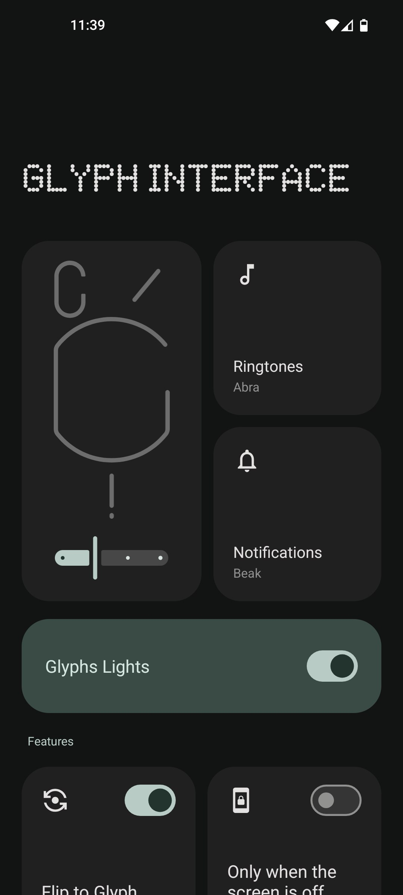
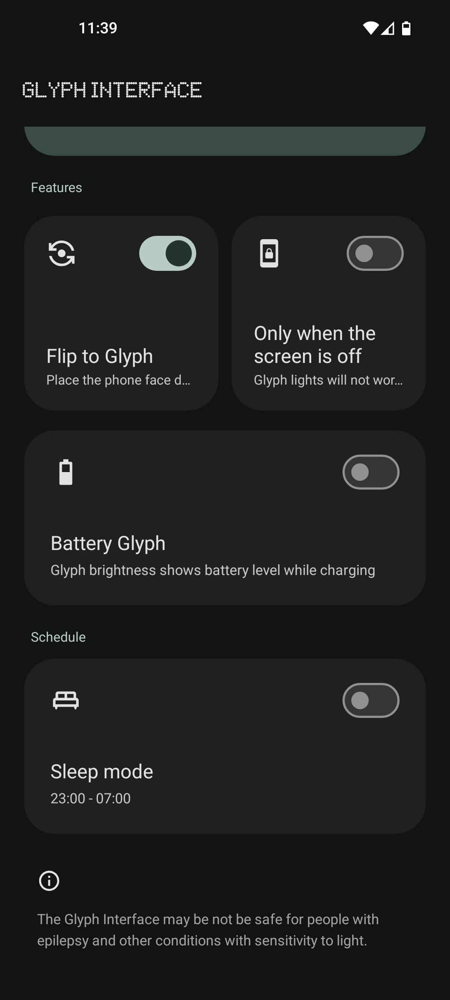
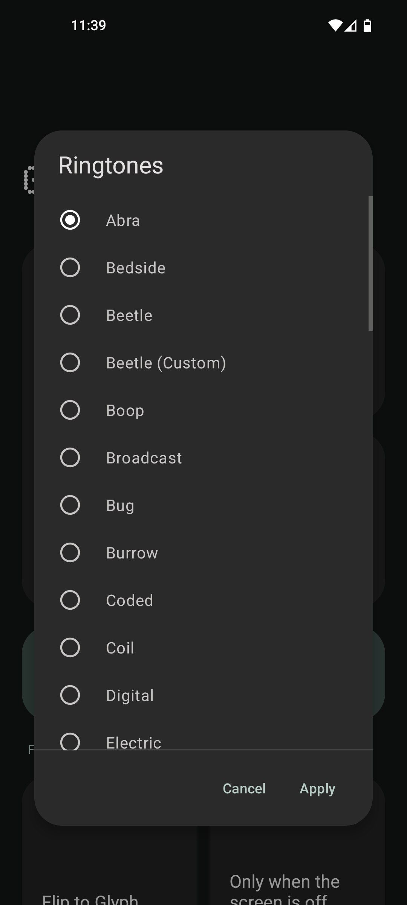
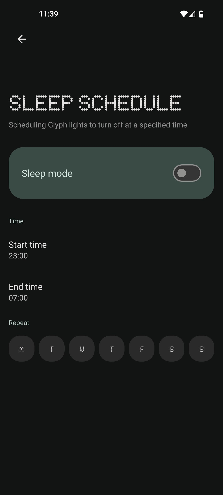

# dGlyphs

dGlyphs is a lightweight app that manages Nothing Phone's (1) Glyphs. It tries to replicate the functionality of the stock implementation.

## For what?
It was originally created for ported roms that don't have Glyphs.

## Features
- Glyph strength
- Call/notifications/Flip to Glyph styles
- Flip to Glyph
- QS tiles
- Battery Glyph
- Sleep mode
- Monet theme and nice UI =)

## Screenshots (2.1)
<table>
  <tr>
    <td></td>
    <td></td>
    <td></td>
    <td></td>
  </tr>
  <tr>
    <td align="center">Main Activity</td>
    <td align="center">Main Activity 2</td>
    <td align="center">Ringtone Styles</td>
    <td align="center">Sleep Mode Activity</td>
  </tr>
</table>

## License
This project is licensed under GPLv3, and all NothingOS related assets are property of Nothing Technology Limited.

## Download

